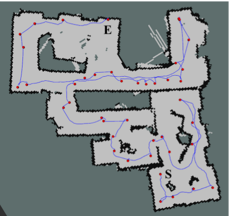

# Autonomous Exploration

## 总结
- 总体上看，自动探索目前研究的主流还是基于frontier的自动探索，研究热点在如何合理的规划探索的策略使得能够建出更完整的地图，花费更短的时间，行走更短的距离，耗费更少的能量。基于快速随机探索树（Rapidly Random-exploration Tree）的方法近些年被多次引用。
- 实验评价方式上，目前没有看到有文章中提起公开的地图数据集。都是在不同面积的模拟地图中进行测试和对比，并衡量探索区域完整度，时间消耗，行走距离这些指标进行对比。
对比的方法多是与不同的frontier探索策略进行对比。
- 基于信息理论的方法在17年，18年相对与frontier较少；
- 增强学习，对设备计算性能要求更高一些，

## 基于边界探索

- Yamauchi 提出的基于frontier的自动探索算法是自动探索领域的开山之作。通过检测Free和unknown之间的边界，作为下一步要探索的目标点。基于此，一系列基于此方法的的自动探索方法被提出$^{[1]}$。
- 2006年提出的基于边界的概率探索策略$^{[2]}$。
- 2010年的动态边界探索策略$^{[3]}$。
- 2011年的基于直方图的边界探索策略$^{[8]}$。同时多机器人协同探索也大量涌现。1998年Yamauchi就已经开始研究多机器人协同探索。主要目标是避免重复探索，减少探索移动路径和加快探索速度。
##### 边界检测研究
- 近些年来，很多方法在研究如何加快边界的检测速度。
  - 2014年Keida和Kaminla提出了快速检测边界算法。$^{[4]}$ Wavefront frontier detector (WFD) 和 fast frontier detector（FFD). 
  - 2017年，Umari提出了快速探索随机树（Rapidly-exploration Random Tree）方法，来检测边缘，如果树的边同时落在未知区域和已知区域的话，那这个拥有从未知区域到已知区域的路径的点就是边缘。$^{[5]}$ 
##### 探索路径规划研究
- 在探索路径规划方面，Bircher在2016年提出了利用随机树从机器人位置随机生长出多个随机树，选择信息最多的那个分支进行探索$^{[6]}。
- 2018年提出的基于采样的自动探索算法中利用了快速探索随机树，不同的是更改了树的生长方式和以及存储树的方式$^{[7]}$。
- 2018年发表的论文$[11]$研究了如何确定最优的frontier进行探索，使得机器人走最短的路径，并减少探索重复区域（没有与其他方法进行比较）。
- 2019年公开在arXiv上的论文[13]，提出一种基于Frontier的选择优化策略，考虑信息增益，导航代价以及机器人定位的精确度。在导航部分提出multistep 规划方案，来提高探索的效率。该方法与以下4个方法进行了比较,比较的指标有时间和行走距离：
  - 随机选择frontier
  - 选择最近frontier
  - 贪心算法选择frontier（没有明确说明，贪心选择信息最大的可能性比较大）
  - 快速随机探索树$^{[5]}$的方法
    
 

    
时间对比

    
 

    
距离对比

## 基于信息理论探索

- 基于信息理论的探索目标是可信区域中未知区域的不确定性。  
  - 2013年提出的基于互信息理论的自动建图方法。直接作用与栅格地图，计算互信息奖励地图，通过一个控制函数来使得机器人探索未知区域使奖励最大化$^[9]$。
  - 最近2017年一篇公开在arXiv的文章提出,利用贝叶斯优化技术选择最优的探索路径，使得地图的信息熵最快减小$^{[10]}$（与$[1]$进行了比较，拥有更快速的地图信息熵减速度）。

  
 

## 增强学习
- 2019年发表的基于深度增强学习（DRL）Asynchronous Advantage Actor-critic(A3C)的自动探索文章$[12]$。结合了增强学习和基于frontier的探索方法，使其能够更快的探索更全面的路径。该方法在3种面积不同的（20×20，60×60,80×80）30个随机生成的地图上进行测试，探索面积可以达到98.4%,98.1%和97.6% 
  - 该方法与以下基于frontier的方法在随机生成的50个环境中进行了测试比较：该方法能够在更短的路径下探索更多的区域。
    - 选择最近的frontier方法
    - 选择获取信息增益最大的frontier的方法
    - 结合距离和信息增益的frontier选取方法
    - 选取机器人朝向顺时针方向并且距离在10m以内的frontier的策略

 

在现实场景中用GMapping建出的图，15×15,耗时835s，覆盖97%，行走95m

## 评测方法  
- 在[6]中，自动探索的评测实验在两个模拟环境，一个真实环境中进行。
  - 仿真场景1：182m$^2$, 机器人的半径0.175m，雷达探索半径为50m。
  - 仿真场景2：49m$^2$, 雷达探索半径设为5m，
  - 真实场景3：面积未知，雷达探索半径4m，
  实验结果
  
 

- 在[7]中，基于采样的自动探索与[6]进行了比较，
  - 机器人的参数为：机器人半径0.175m，最大速度为0.3m/s，最大加速度为0.05m/s$^2$,雷达探测距离60m，角度为240度。
  - 自定义模拟场景1：300m$^2$。耗时对比结果
  
 
  
  - 自定义模拟场景2：240m$^2$。耗时对比结果
  
 

## 参考文献

- [1]. B. Yamauchi, “A frontier-based approach for autonomous exploration,” in IEEE International Symposium on Computational Intelligence in Robotics and Automation, 1997. Cira’97., Proceedings, pp. 146–151, 2002.
- [2]. L. Freda and G. Oriolo, “Frontier-based probabilistic strategies for sensor-based exploration,” in IEEE International Conference on Robotics and Automation, pp. 3881–3887, 2006.
- [3]. J. Wettach and K. Berns, “Dynamic frontier based exploration with a mobile indoor robot,” in Robotics, pp. 1–8, 2010.
- [4]. M. Keidar and G. A. Kaminka, Efficient frontier detection for robot exploration. Sage Publications, Inc., 2014.
- [5]. H. Umari and S. Mukhopadhyay, “Autonomous robotic exploration based on multiple rapidly-exploring randomized trees,” in 2017 IEEE/RSJ International Conference on Intelligent Robots and Systems (IROS), pp. 1396–1402, Sept 2017 
- [6]. A. Bircher, M. Kamel, K. Alexis, and H. Oleynikova, “Receding horizon ”next-best-view” planner for 3d exploration,” in IEEE International Conference on Robotics and Automation, pp. 1462–1468, 2016.
- [7]. Topiwala A, Inani P, Kathpal A. Frontier Based Exploration for Autonomous Robot[J]. 2018.
- [8]. A. Mobarhani, S. Nazari, A. H. Tamjidi, and H. D. Taghirad, “Histogram based frontier exploration,” in Ieee/rsj International Conference on Intelligent Robots and Systems, pp. 1128–1133, 2011.
- [9]. Julian B J , Karaman S , Rus D . On mutual information-based control of range sensing robots for mapping applications[C]// Intelligent Robots and Systems (IROS), 2013 IEEE/RSJ International Conference on. IEEE, 2013.
- [10]. Francis G , Ott L , Marchant R , et al. Occupancy Map Building through Bayesian Exploration[J]. 2017.
- [11]. W. Gao, M. Booker, A. Adiwahono, M. Yuan, J. Wang and Y. W. Yun, "An improved Frontier-Based Approach for Autonomous Exploration," 2018 15th International Conference on Control, Automation, Robotics and Vision (ICARCV), Singapore, 2018, pp. 292-297.
- [12]. F. Niroui, K. Zhang, Z. Kashino and G. Nejat, "Deep Reinforcement Learning Robot for Search and Rescue Applications: Exploration in Unknown Cluttered Environments," in IEEE Robotics and Automation Letters, vol. 4, no. 2, pp. 610-617, April 2019.
- [13]. B. Fang, J. Ding and Z. Wang, "Autonomous robotic exploration based on frontier point optimization and multistep path planning," in IEEE Access, vol. 7, pp. 46104-46113, 2019.
doi: 10.1109/ACCESS.2019.2909307